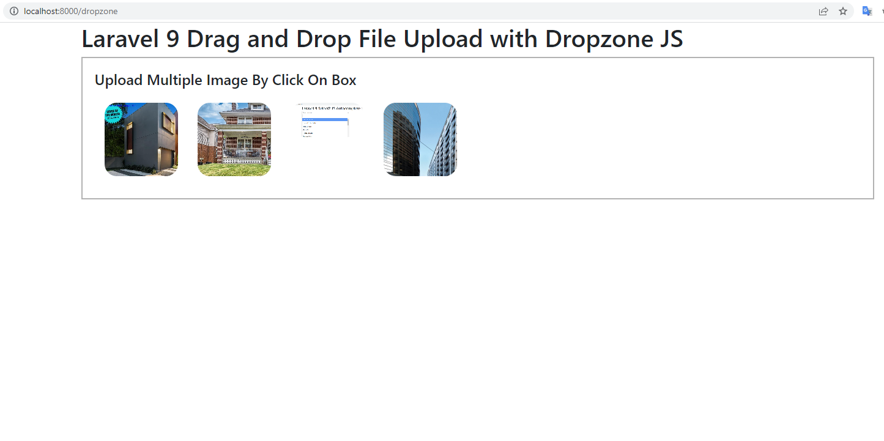

# laravel9_drag_and_drop_file_upload_with_dropzone_js
## 1: Install Laravel 9
```Dockerfile
composer create-project laravel/laravel laravel9_drag_and_drop_file_upload_with_dropzone_js
```
## 2: Create Controller
- app/Http/Controllers/DropzoneController.php
```Dockerfile
<?php
  
namespace App\Http\Controllers;
  
use Illuminate\Http\Request;
 
class DropzoneController extends Controller
{
    /**
     * Generate Image upload View
     *
     * @return void
     */
    public function index()
    {
        return view('dropzone');
    }
      
    /**
     * Image Upload Code
     *
     * @return void
     */
    public function store(Request $request)
    {
        $image = $request->file('file');
     
        $imageName = time().'.'.$image->extension();
        $image->move(public_path('images'),$imageName);
     
        return response()->json(['success'=>$imageName]);
    }
}
```
## 3:  Add Routes
routes/web.php
```Dockerfile
<?php
  
use Illuminate\Support\Facades\Route;
  
use App\Http\Controllers\DropzoneController;
  
/*
|--------------------------------------------------------------------------
| Web Routes
|--------------------------------------------------------------------------
|
| Here is where you can register web routes for your application. These
| routes are loaded by the RouteServiceProvider within a group which
| contains the "web" middleware group. Now create something great!
|
*/
  
Route::controller(DropzoneController::class)->group(function(){
    Route::get('dropzone', 'index');
    Route::post('dropzone/store', 'store')->name('dropzone.store');
});
```
## 4: Add Blade File
- resources/views/dropzone.blade.php
```Dockerfile
<!DOCTYPE html>
<html>
<head>
    <title>Laravel 9 Drag and Drop File Upload with Dropzone JS</title>
    <link href="https://cdn.jsdelivr.net/npm/bootstrap@5.0.2/dist/css/bootstrap.min.css" rel="stylesheet">
    <script src="https://unpkg.com/dropzone@5/dist/min/dropzone.min.js"></script>
    <link rel="stylesheet" href="https://unpkg.com/dropzone@5/dist/min/dropzone.min.css" type="text/css" />
</head>
<body>
    
<div class="container">
    <div class="row">
        <div class="col-md-12">
            <h1>Laravel 9 Drag and Drop File Upload with Dropzone JS</h1>
    
            <form action="{{ route('dropzone.store') }}" method="post" enctype="multipart/form-data" id="image-upload" class="dropzone">
                @csrf
                <div>
                    <h4>Upload Multiple Image By Click On Box</h4>
                </div>
            </form>
        </div>
    </div>
</div>
    
<script type="text/javascript">
  
        Dropzone.autoDiscover = false;
  
        var dropzone = new Dropzone('#image-upload', {
              thumbnailWidth: 200,
              maxFilesize: 1,
              acceptedFiles: ".jpeg,.jpg,.png,.gif"
            });
  
</script>
    
</body>
</html>
```
## 5: Run Laravel App:
```Dockerfile
php artisan serve
```
- Vào http://localhost:8000/dropzone




